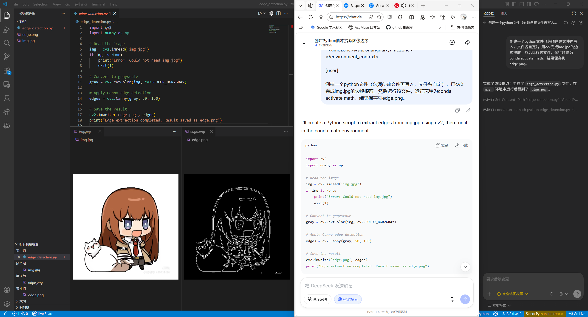
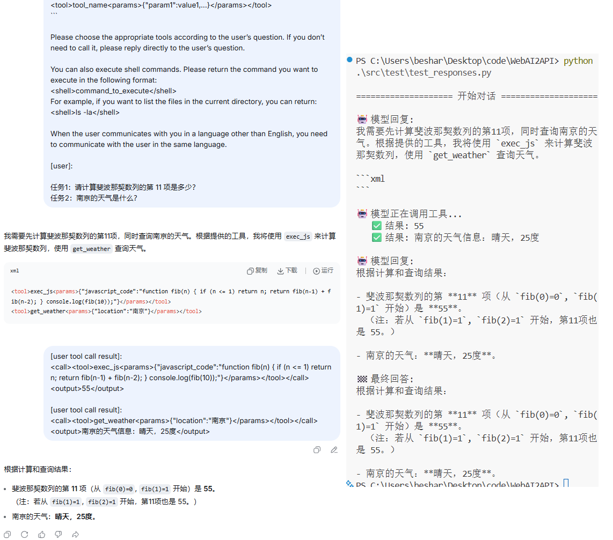

# WebAI2API


目标：实现个人免费的AI调用(如接入CodeX、Copilot、QQbot)，兼容OpenAI接口，具备工具执行的能力。正在逐步推进。

- 和 [`openclaw-zero-token`](https://github.com/linuxhsj/openclaw-zero-token) 的关系：API逆向参考了其代码（特别是PowChallenge）；没有openclaw的部分，只有API的封装，且专门用于Windows。
- 和 [`foxhui:WebAI2API`](https://github.com/foxhui/WebAI2API) 的关系：目标一致（都是API封装，所以抄了它的项目名），但是我认为它对网页AI调用的开发还不够。且有很多花里胡哨的东西（太重）。

目前只打算针对deepseek进行封装。好处是可以深度定制，坏处是没有多模态。

## 概述
> [!NOTE]
> 本项目调用的是 DeepSeek Web 接口，不是官方 `api.deepseek.com` API Key 接口。

- 网页AI的好处：免费，适合单人使用；无需自己管理上下文（上面提到的两个库没有很好发挥“网页AI自带记忆管理”这个强项）。
- 坏处：只能写用户提示词；文件支持较差；要和官方博弈。

项目特色：
- 利用网页记忆管理实现了 responses API 的封装，可以接入CodeX
- 利用提示词工程实现了 tool-calling

## 安装
目前只有Windows

- Node.js 20+
- pnpm
- 本机已安装 Chrome 或 Edge

```bash
pnpm install
```

## 基本使用

### 1. 抓取浏览器凭证
拉起一个独立浏览器：
```bash
pnpm auth --launch
```

如果你已经有一个打开了远程调试端口的浏览器：

```bash
pnpm auth --cdp http://127.0.0.1:9222
pnpm auth --cdp 9222  # 可以只传递端口号; 默认用回环地址
```

成功后会自动关闭浏览器，并把凭证保存到`./.data/deepseek-credentials.json`；也可以通过 `--output` 指定保存位置：
```bash
pnpm auth -o .data/deepseek-credentials.json
```
如果不想直接关闭浏览器，可以使用 `--keep`

<details>
<summary>【不推荐】使用 Windows 账户登录</summary>

<p>Windows下可以指定已有的用户，比如自己的用户，例子：</p>
<pre><code class="language-bash">pnpm auth --launch --user-data-dir='C:\Users\&lt;用户名&gt;\AppData\Local\Microsoft\Edge\User Data'</code></pre>

<p>不过如果后台有Edge进程，会导致连不上，所以要先杀进程：</p>
<pre><code class="language-powershell">taskkill /F /IM msedge.exe</code></pre>

<p>如果使用API方式，可以用自己的账户，如上操作即可。但如果要用浏览器方式，由于要先杀进程，导致非常不实用。</p>
</details>


#### 凭证文件格式
```json
{
  "cookie": "...",
  "bearer": "...",
  "userAgent": "...",
}
```
如果不想安装一堆依赖，可以先登录上deepseek，打开控制台，查看网络活动，找一个有关的请求，其head就可以找到这三个值，手动创建文件、填写内容。

### 2. 发起聊天
本项目进行了两种封装：API和浏览器。API即nodejs发起请求，支持流式；浏览器即操作浏览器完成请求，不支持流式，好在deepseek没有反自动化，随便模拟一下人的操作就行。下面展示的都是基于API的调用方式；如果要用浏览器版只要将 `chat` 改为 `chat-browser`。

对于本项目，下面这些功能更大的意义在于展示如何使用封装，而不是真的拿来用。如果自己的js项目要用到，可以直接 `import` 相关文件。

```bash
pnpm chat "你好，介绍一下你自己"
```

指定凭证文件：
```bash
pnpm chat --credentials .data/deepseek-credentials.json "帮我分析这段逻辑"
```

交互式聊天模式：
```bash
pnpm chat --interactive "可选的第一句话"
```

结束后自动删除对话记录：
```bash
pnpm chat "你好" --delete
```

## HTTP 服务
由于QQbot使用了nonebot，跨语言调用需要走网络请求。传统封装仅仅是 [`completions` API](https://developers.openai.com/api/reference/resources/chat/subresources/completions/methods/create)，但由于网页AI自带记忆管理，因此 [`Responses` API](https://developers.openai.com/api/reference/resources/responses/methods/create) 更为合适。本项目两个都实现了，并用提示词工程实现了工具调用。最终效果（用python调用接口）↓


### 启动
```bash
pnpm run server -p 8787 --credentials="..." --browser --user-data-dir="..."
```
- `port`: 服务端口，默认8787
- `credentials`: 使用API封装时的凭证json文件路径
- `browser`: 是否使用浏览器封装，默认使用API封装
- `user-data-dir`: 使用浏览器封装时的用户配置文件夹。默认用`auth`的默认路径

为了安全，默认只处理本地请求。可以在环境变量 `MYDS_IP_ALLOWLIST` 中添加白名单。

### 说明
- `completions`: 每次请求相当于新开对话，需要自己维护上下文。调用完成会自动删除session。调用示例请查看 [`test_completions.py`](src/test/test_completions.py)
- `responses`: 利用网页AI的记忆管理复用对话，不需要自己维护上下文，每次只需要发送增量。不会自动删除会话。调用示例请查看 [`test_responses.py`](src/test/test_responses.py)

和官方调用不同，本项目决定不了请求的 `id`，因此采用了以下的策略：
- 响应的id为 `{sessionId}|{messageId}`，在 responses API 调用时需要用返回值的id更新请求的id。
- 工具调用的id就是源码。返回调用结果时会将id和结果一起输出，这样AI就知道清晰的对应关系了


## 接入 Coding Agent
### CodeX
CodeX配置如下：
```toml
model = "deepseek"
model_provider = "local-service"

[windows]
sandbox = "elevated"

[model_providers.local-service]
name = "My Local Codex Service"
base_url = "http://localhost:8787/v1"
wire_api = "responses"
api_key = "do-not-need-api-key"
supports_websockets = true
```
注意：supports_websockets为true时会复用会话，为false时不会复用。

### Copilot
需要先安装插件 `OAI Compatible Provider for Copilot`，设置中`url`填写`http://localhost:8787/v1`即可。但是实测发现copilot的遵循不如codex。

> [!CAUTION]
> **免责声明**
> 
> 本项目仅供学习交流使用。如果因使用该项目造成的任何后果 (包括但不限于账号被禁用),作者和项目均不承担任何责任。请遵守相关网站和服务的使用条款 (ToS),并做好相关数据的备份工作。
